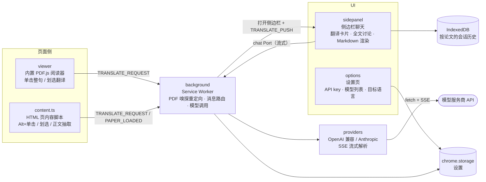

<div align="center">

# 📖 英文论文阅读助手

**Ask AI · Chrome 扩展**

在 PDF 和 HTML 页面上点击 / 划选即可流式翻译，侧边栏支持基于全文的 AI 讨论


</div>

---

## ✨ 功能

| | |
|---|---|
| 🖱️ **PDF 点击翻译** | 打开任意在线 / 本地 PDF 自动进入内置 PDF.js 阅读器，单击一行即翻译整句，结果带原文引用、流式输出 |
| ✏️ **划选翻译** | PDF 或网页上划选任意文字即刻翻译 |
| 📄 **HTML 段落翻译** | 普通网页上 Alt+单击（Mac：⌥ Option+单击）段落即翻译 |
| 💬 **整篇讨论** | 侧边栏基于当前论文 / 页面全文提问，回答流式返回 |
| 🤖 **多模型支持** | 内置 7 家预设，可添加自定义 OpenAI 兼容端点，对话中随时切换 |
| 💾 **会话持久化** | 按论文保存对话历史，切标签自动跟随，重开自动恢复 |

<details>
<summary><b>内置模型预设</b>（设置页可编辑，支持添加任意模型名）</summary>

| 预设 | 模型 |
| --- | --- |
| Claude | claude-opus-4-8 / claude-sonnet-4-6 / claude-haiku-4-5 |
| GPT | gpt-5.5 / chat-latest |
| DeepSeek | deepseek-v4-flash / deepseek-v4-pro |
| GLM | glm-5.1 / glm-4.7 |
| Kimi | kimi-k2.6 |
| Qwen | qwen-max / qwen-plus / qwen-turbo |
| MiniMax | MiniMax-M3 / MiniMax-M2.7 |

</details>

## 🚀 快速开始

> 环境要求：Node.js ≥ 18，Chrome ≥ 120

```bash
npm install
npm run build        # 构建并自动同步到 dist-chrome/（供 Chrome 加载的可见目录）
```

**加载扩展**：

1. Chrome 打开 `chrome://extensions`，开启右上角「开发者模式」
2. 点「加载已解压的扩展程序」，选择项目下的 **`dist-chrome/`** 目录
   > 💡 之所以不直接加载构建原始产物 `.output/chrome-mv3/`，是因为 macOS 文件选择框默认隐藏点开头的文件夹；`dist-chrome/` 是构建后自动同步的一份可见副本，内容完全相同
3. 在扩展的 Options 页填入至少一家模型的 API key，选好默认模型和目标语言
4. 本地 PDF（`file://`）场景需在扩展详情页开启「允许访问文件网址」

**一分钟体验**：打开 <https://arxiv.org/pdf/1706.03762>，单击正文任意一行 → 侧边栏弹出流式中文翻译 🎉

> **更新与移除**：改完代码 `npm run build` 后，在 `chrome://extensions` 点扩展卡片的刷新 ⟳ 即可生效，不必移除重装；移除扩展会清空 `chrome.storage`，API key 需要重填。

## 📖 使用方法

**四种核心操作**：

| 操作 | 触发方式 |
|---|---|
| PDF 整句翻译 | 内置阅读器中**单击**正文任意一行 |
| 划选翻译 | PDF 或网页上**划选**文字 |
| HTML 段落翻译 | 网页上 **Alt+单击**（Mac：⌥ Option+单击）段落 |
| 全文讨论 | 侧边栏输入框直接提问（`Enter` 发送，`Shift+Enter` 换行） |

**打开侧边栏的三种方式**：

- 点正文触发翻译时自动弹出
- 点工具栏的 Ask AI 图标（首次可在拼图菜单 🧩 里点 📌 固定到工具栏）
- 侧边栏右上角图钉让它常驻

会话按论文持久化：切换标签页自动跟随显示对应会话，关闭重开同一论文恢复历史记录。

## 🛠️ 开发

```bash
npm run dev          # WXT 开发模式（热重载）
npm test             # vitest 单元测试
npm run compile      # tsc --noEmit 类型检查
npm run build        # 生产构建
```

`tmp/smoke3.mjs`（PDF 链路）与 `tmp/smoke-html.mjs`（HTML 链路）是 Playwright 真实浏览器冒烟脚本，`node` 直接运行，需先 `npm run build`。

## 📁 项目结构

```
entrypoints/         # WXT 入口（约定目录名，每个子项编译为扩展的一个组成部分）
  background.ts      #   后台：PDF 嗅探重定向、翻译请求分发、chat Port、模型调用
  content.ts         #   内容脚本：HTML 页正文抽取、Alt+单击/划选翻译
  viewer/            #   内置 PDF.js 阅读器页面
  sidepanel/         #   侧边栏聊天 UI（React）
  options/           #   设置页：API key、模型列表、目标语言、自定义端点
providers/           # 模型供应商适配（OpenAI 兼容 / Anthropic 原生）
shared/              # 纯逻辑层：类型、消息契约、预设、SSE 解析、提示词构建、扩句
sidepanel-lib/       # IndexedDB 会话存储
tests/               # vitest 单元测试（纯逻辑层全覆盖）
specs/               # 功能规格、计划、任务（vibe-coding-spec 工作流产物）
quality/             # 测试矩阵、测试报告、发布门禁与证据
```

技术栈：[WXT](https://wxt.dev)（MV3 扩展框架）+ React 19 + PDF.js + TypeScript + Vitest

## 🏗️ 架构



**三条关键链路：**

1. **PDF 接管**：background 用 `webRequest` 嗅探响应头，发现 `application/pdf` 就把标签页重定向到内置阅读器（`viewer.html?file=原始URL`）；`file://` 本地 PDF 走后缀名兜底。点「Open native viewer」可绕过。
2. **点击 / 划选翻译**：viewer 或 content script 发 `TRANSLATE_REQUEST` 给 background → background **先打开侧边栏**（保住用户手势），再广播 `TRANSLATE_PUSH`；若侧边栏尚未就绪，请求暂存为 pending，侧边栏挂载后通过 `GET_PENDING_TRANSLATE` 取件——保证消息不丢。
3. **流式对话**：侧边栏通过长连接 chat Port 把消息和所选模型发给 background，background 读取设置选择对应 provider，直接 `fetch` 模型服务商 API 并解析 SSE，逐 token 推回侧边栏渲染；断开 Port 即中止请求。

**分层约定**：`shared/` 是纯逻辑层（消息契约、SSE 解析、提示词构建、扩句、设置合并），不依赖任何浏览器 API，可注入可替身，单元测试全覆盖；浏览器相关代码集中在 `entrypoints/`，provider 通过注入 `fetch` 保持可测。

## 📚 文档目录

<details>
<summary><b>specs/001-ask-ai-extension/ — 功能规格与执行过程</b></summary>

| 文档 | 是什么 / 什么时候看 |
| --- | --- |
| `spec.md` | 功能规格：用户故事、功能需求、验收标准；想了解「做什么」先看这里 |
| `plan.md` | 实现计划：技术选型、架构分层、阶段划分；想了解「怎么做」看这里 |
| `tasks.md` | 任务清单：按依赖排序的开发任务及完成状态；查进度或续做时看 |
| `clarify.md` | 需求澄清问答记录；想知道某个决策为什么这样定时查 |
| `research.md` | 技术调研：PDF.js 集成、MV3 限制等关键问题的结论与依据 |
| `data-model.md` | 数据模型：实体、字段、存储位置（chrome.storage / IndexedDB） |
| `contracts/` | 内部接口契约：扩展内消息协议、模型供应商适配接口 |
| `quickstart.md` | 面向开发者的最小验证步骤；改完代码想快速手验时看 |
| `prd-source.md` | 原始 PRD 输入存档；追溯需求源头时看 |
| `traceability.md` | 需求 → 任务 → 测试的追踪矩阵；做覆盖审计时看 |
| `run-state.json` | vibe-coding-spec 工作流的跨会话状态机；由工具读写，一般不用手动看 |
| `CHECKLIST.md` | 功能级核对清单：各阶段门禁是否通过 |
| `checklists/` | 专项核对清单目录 |

</details>

<details>
<summary><b>quality/V0.1/ — 测试与发布证据</b></summary>

| 文档 | 是什么 / 什么时候看 |
| --- | --- |
| `TEST_MATRIX.md` | 测试矩阵：各功能 × 各验证手段的覆盖计划；设计测试时看 |
| `TEST_REPORT.md` | 测试报告：实际执行结果汇总；想知道当前质量状态看这里 |
| `RELEASE_GATE.md` | 发布门禁：v0.1 放行判定及依据；发版前必看 |
| `evidence/` | 原始证据：构建日志、tsc/单测输出、冒烟结果、密钥扫描等；审计报告结论时查 |

</details>

## 🔒 隐私

API key 与会话记录仅存储在浏览器本地（`chrome.storage` / IndexedDB），翻译与讨论请求**直接从浏览器发往你配置的模型服务商**，无任何中间服务器。
